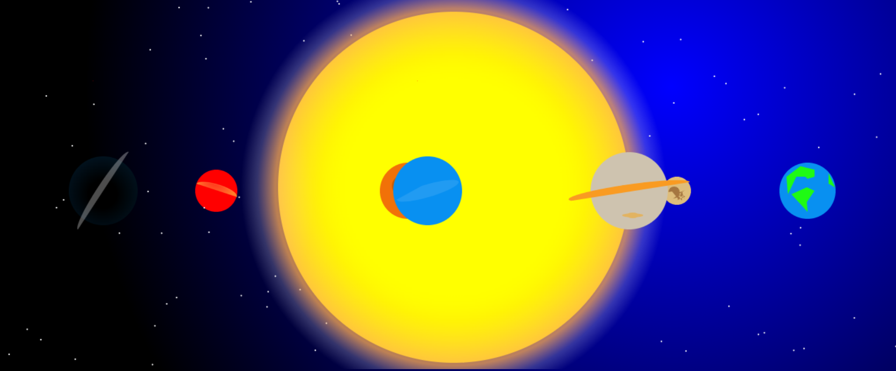
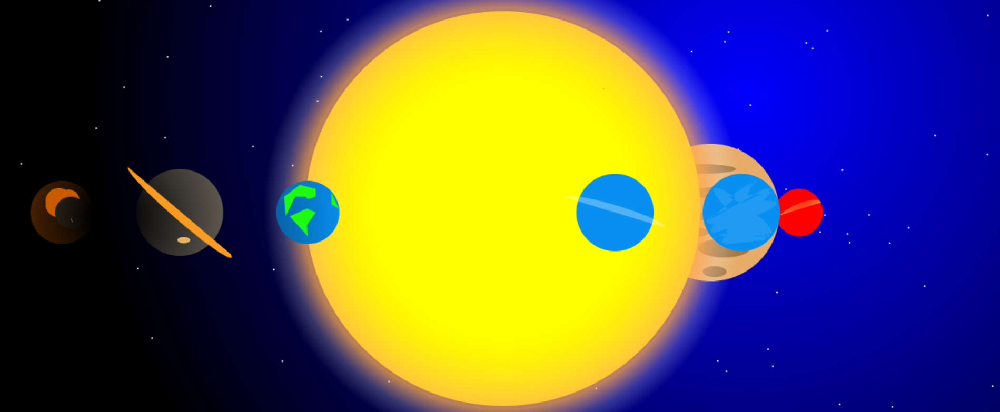
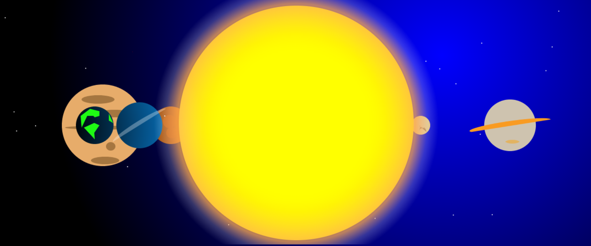
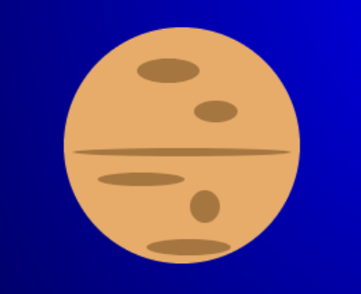
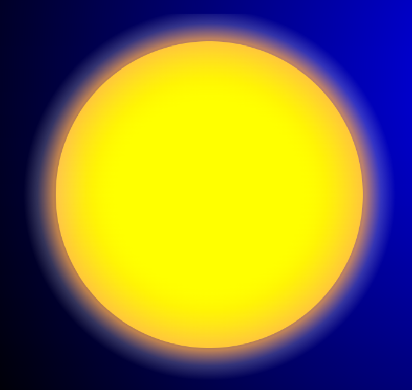
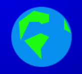
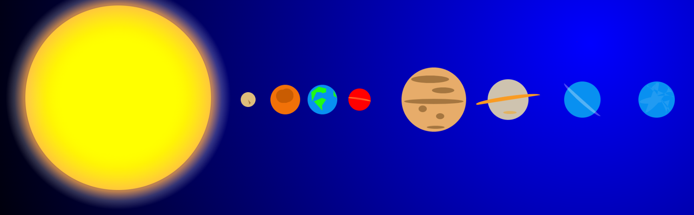

= Compte Rendu : Virtual Landscape
:toc-title: Tables des matières
:toc: top

Projet réalisé par : *Devamadushan* +
Du 05/04/2023 au 10/05/2023 +

== I.Contexte
----
Dans le cadre du projet Virtual Landscape, l'objectif était d'apprendre à prendre en main une application existante, de développer des compétences en programmation JavaScript dans une approche orientée objet et événementielle, d'explorer une nouvelle technologie de manière autodidacte et de stimuler sa créativité.
----

== II. Introduction
----
Dans un premier temps, je vais vous présenter la réalisation du projet en expliquant le code de la planète (Jupiter), puis les difficultés que j'ai rencontré et je terminerai par une conclusion personnelle.
----
<<<
Le projet s'inspire du système solaire. Ci-dessous, vous trouverez quelques clichés générés aléatoirement.

<<<

== III. Explication du code (planète Jupiter)

[source,js]
----
export { Jupiter } from './Jupiter.js';
----
Ce code permet d'appeler la classe Jupiter dans le fichier index.

[source,js]
----
ctx.beginPath();
    ctx.arc(ox + 50, oy + 325 - 150, 87, 0, Math.PI * 2, true);
    ctx.fillStyle = '#E7AC6A';
    ctx.fill();
    ctx.strokeStyle = `rgba(0,0,0,0)`
    ctx.closePath;
----

Ce code permet de créer un cercle avec une couleur marron claire sans contour avec les coordonnées des variables ox et oy.

<<<

[source,js]
----
    ctx.beginPath();
    ctx.ellipse(ox + 50, oy + 330 - 150, 80, ~~(Math.random() * 5) + 3, 0, 0, Math.PI * 2)
    ctx.fillStyle = '#A57640';
    ctx.fill();
    ctx.beginPath();
    ctx.ellipse(ox + 67, oy + 370 - 150, ~~(Math.random() * 46) + 10, ~~(Math.random() * 10) + 3, 0, 0, Math.PI * 2)
    ctx.fillStyle = '#A57640';
    ctx.fill();
    ctx.beginPath();
    ctx.ellipse(ox + 40, oy + 270 - 150, ~~(Math.random() * 46) + 10, ~~(Math.random() * 8) + 3, 0, 0, Math.PI * 2)
    ctx.fillStyle = '#A57640';
    ctx.fill();
    ctx.beginPath();
    ctx.ellipse(ox + 75, oy + 300 - 150, ~~(Math.random() * 46) + 10, 8, 0, 0, Math.PI * 2)
    ctx.fillStyle = '#A57640';
    ctx.fill();
    ctx.beginPath();
    ctx.ellipse(ox + 55, oy + 400 - 150, ~~(Math.random() * 26) + 10, ~~(Math.random() * 8) + 3, 0, 0, Math.PI * 2)
    ctx.fillStyle = '#A57640';
    ctx.fill();
    ctx.beginPath();
    ctx.ellipse(ox + 20, oy + 350 - 150, ~~(Math.random() * 26) + 10, ~~(Math.random() * 8) + 3, 0, 0, Math.PI * 2)
    ctx.fillStyle = '#A57640';
    ctx.fill();
    ctx.stroke();
----
Ce code permet de créer des crevasses dans la planète pour les personnaliser et les différencier des autres planètes, et change de formes aléatoirement pour chaque synchronisation.

[source,js]
----
static buildForms() {
    let forms = []
    forms.push(new Jupiter(~~(Math.random() * 1100), 100, 10, 10, '', 'white', 1, false, ~~(Math.random() * 3)))
    return forms
  }
----
Cette méthode génère le dessin de la planète Jupiter avec les variable ox et oy dans le tableau (Forms) , en modifiant leur position aléatoirement avec la Fonction *Math.random()* lors de chaque synchronisation.

== II. Difficultés rencontrées

** La première difficulté que j'ai rencontré est la création du Soleil, car je n'arrivai pas à la faire briller et faire un dégradé.

<<<

**  Le deuxième problème que j'ai rencontré a été de créer les continents de la planète Terre, car ces continents ne sont pas de simples formes géométriques. Je devais être rigoureux lors du tracé des continents pour leur donner la forme la plus réaliste et convaincante possible.

** Le troisiéme probleme que j'ai renconté est de  personalliser chaque planetes pour ne pas avoir de ressemblance ou des confusion.

== IV. Conclusion
Le projet m'a aidé à développer mes connaissances en JavaScript et ma créativité. Cependant, il y a aussi quelques tâches que je n'ai pas réussi à accomplir, comme générer d'autres continents lors de chaque synchronisation de la planète Terre. Enfin, j'ai ressenti une satisfaction à la fin du projet en reproduisant ce que j'avais imaginé.
